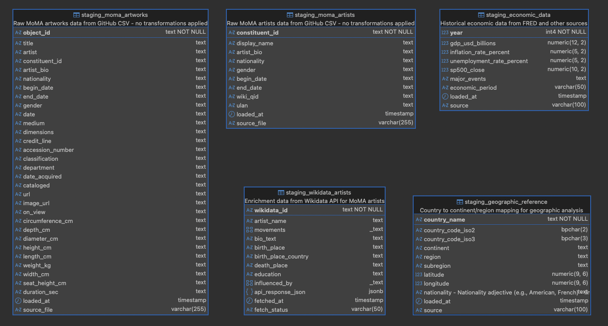
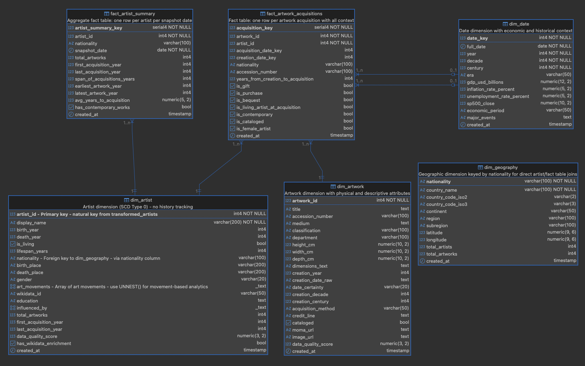

# 📊 MoMA Art Collection Analytics - Data Engineering Project

> An end-to-end data pipeline that transforms MoMA's public art collection into an analytics-ready data warehouse, enriched with historical, economic, and biographical context.

## 🎯 Project Overview

This project demonstrates **production-grade data engineering practices** using real-world museum data:

- **Orchestrated with Apache Airflow** - 5 modular DAGs managing dependencies and parallel execution
- **Multi-layered architecture** - Staging → Transformation → Dimensional (star schema for BI)
- **Multi-source enrichment** - Combined MoMA data with 3 external APIs (Wikidata, FRED, REST Countries)

**What it does:**
Processes ~140,000 artworks and ~15,000 artists, adding geographic regions, economic context (GDP, recessions), and artist biographies to enable to enable complex analytical reporting.

## 🏗️ Architecture Highlights

### Three-Layer Data Architecture

```
┌─────────────────────────────────────────────────────────────┐
│                     STAGING LAYER                           │
│  Raw data landing zone - exact copy from sources            │
│  • MoMA CSVs (Artworks, Artists)                            │
│  • Wikidata API responses (artist biographies)              │
│  • Economic data (FRED API)                                 │
│  • Geographic reference (REST Countries API)                │
└─────────────────────────────────────────────────────────────┘
                              ↓
┌─────────────────────────────────────────────────────────────┐
│                  TRANSFORMATION LAYER                       │
│  Cleaned, standardized, quality-scored data                 │
│  • Data type conversions (text → integers, dates)           │
│  • Standardization (gender, nationality)                    │
│  • Enrichment (geo mapping, Wikidata merging)               │
│  • Quality scoring (completeness metrics)                   │
│  • Bridge tables (many-to-many relationships)               │
└─────────────────────────────────────────────────────────────┘
                              ↓
┌─────────────────────────────────────────────────────────────┐
│                   DIMENSIONAL LAYER                         │
│  Star schema optimized for analytics (BI-ready)             │
│  • Dimension Tables: Artist, Artwork, Date, Geography       │
│  • Fact Tables: Acquisitions, Artist Summary                │
│  • Pre-aggregated metrics for fast queries                  │
└─────────────────────────────────────────────────────────────┘
```
---

## 🗂️ Database Schema - Entity Relationship Diagrams

### 1. Staging Layer - Raw Data Landing Zone

The staging layer stores unprocessed data exactly as received from sources. All columns are stored as TEXT to preserve original formats.



**Key Tables:**
- `staging_moma_artworks` - Raw artwork data from GitHub CSV (~140K rows)
- `staging_moma_artists` - Raw artist data from GitHub CSV (~15K rows)
- `staging_wikidata_artists` - Enrichment data from Wikidata API (batch SPARQL queries)
- `staging_geographic_reference` - Country/continent mappings from REST Countries API
- `staging_economic_data` - Historical GDP, inflation, unemployment from FRED API

---

### 2. Transformation Layer - Cleaned & Enriched Data

The transformation layer applies data cleaning, type conversions, standardization, and enrichment. Includes quality scoring and bridge tables for many-to-many relationships.


**Key Tables:**
- `transformed_artworks` - Cleaned artwork data with parsed dates, dimensions, and quality scores
- `transformed_artists` - Enriched artist data with geographic context, movements, and Wikidata bio
- `bridge_artwork_artist` - Many-to-many relationship (handles collaborative artworks)
- `transformed_geography` - Geographic reference with artist/artwork counts by nationality
- `transformed_date_economics` - Date dimension with economic context (GDP, recessions, eras)

**Key Transformations:**
- Date parsing: "c. 1920" → year=1920, certainty='circa'
- Gender standardization: "M", "(Male)" → "Male"
- Nationality mapping: "American" → country="United States", continent="North America"
- Quality scoring: Automated completeness metrics (0.0-1.0)

---

### 3. Dimensional Layer - Star Schema for Analytics

The dimensional layer implements a star schema optimized for BI queries. Fact tables reference dimension tables through foreign keys.



**Dimension Tables:**
- `dim_artist` - Artist dimension (SCD Type 0 - no history tracking)
- `dim_artwork` - Artwork dimension with physical attributes
- `dim_date` - Date dimension with economic and historical context
- `dim_geography` - Geographic dimension keyed by nationality

**Fact Tables:**
- `fact_artwork_acquisitions` - One row per artwork acquisition with context
- `fact_artist_summary` - Aggregate fact table (one row per artist)

**Star Schema Benefits:**
- Fast joins (denormalized dimensions)
- Simple queries (business users can write SQL)
- Pre-calculated metrics (years_from_creation_to_acquisition)
- Optimized for aggregations

---

## 📊 Data Flow

### Complete Pipeline Journey

```
1. DATA ACQUISITION
   ├─ Download MoMA CSVs from GitHub
   ├─ Fetch Wikidata biographies
   ├─ Fetch economic indicators (FRED API)
   └─ Fetch country mappings (REST Countries API)
                    ↓
2. STAGING LOAD
   ├─ Load raw CSVs to PostgreSQL (no transformations)
   ├─ Store API responses with metadata
   └─ Preserve raw source data
                    ↓
3. TRANSFORMATION
   ├─ Artists: Clean birth/death years, standardize gender/nationality
   ├─ Artworks: Parse dates (circa/exact/range), extract dimensions
   ├─ Geography: Match nationalities to countries/continents
   ├─ Economics: Classify eras (WWI, Great Depression, etc.)
   └─ Bridge Table: Link artworks ↔ artists (many-to-many relationship)
                    ↓
4. DIMENSIONAL MODELING
   ├─ Build dimension tables (SCD Type 0 - mostly static data)
   ├─ Create fact tables with foreign keys
   ├─ Calculate derived metrics (years to acquisition, etc.)
   └─ Add economic context to acquisition facts
                    ↓
5. ANALYTICS-READY DATA
   └─ Can be consumed by BI tools (Tableau, Power BI, etc.)
```

### Key Data Engineering Concepts Demonstrated

#### 1. **Batch SPARQL Queries for API Efficiency**
Instead of fetching Wikidata one artist at a time (15,000 requests), the pipeline batches 50 artists per query:
- **Before**: 15,000 API calls × 1 second = 4+ hours
- **After**: 300 batches × 1 second = 5 minutes

#### 2. **Vectorized Data Transformation**
Uses pandas vectorization instead of row-by-row iteration:
```python
# ❌ Slow: 140,000 iterations
for row in df.iterrows():
    if 'c.' in row['date']:
        row['certainty'] = 'circa'

# ✅ Fast: Single vectorized operation
df.loc[df['date'].str.contains('c.'), 'certainty'] = 'circa'
```
**Result**: Artwork transformation runs in seconds instead of minutes

#### 3. **Bridge Table Pattern**
Handles many-to-many relationships (collaborative artworks):
```
Artwork "Guernica" ───┐
                      ├─→ Bridge Table ──→ Artist "Picasso"
Artwork "The Kiss" ───┘                  (with role metadata)
```
**Why**: Some artworks can have multiple artists; some artists collaborate frequently

---

## 🔄 Airflow DAG Structure

### Master Orchestration Pipeline

The project uses **5 DAGs** organized in a hierarchical structure for modularity and parallel execution:

```
┌───────────────────────────────────────────────────────────────┐
│          moma_master_pipeline (Orchestrator)                  │
│  Triggers all child DAGs in sequence, waits for completion    │
└───────────────────────────────────────────────────────────────┘
                              │
                ┌─────────────┼─────────────┐
                ↓             ↓             ↓
        ┌──────────┐  ┌────────────┐  ┌──────────────┐
        │ Download │  │   Create   │  │     ...      │
        │   Data   │  │  Schemas   │  │              │
        └──────────┘  └────────────┘  └──────────────┘
```

### DAG Hierarchy (Execution Order)

```
1. moma_master_pipeline
   ├─ Phase 1: Setup (parallel)
   │   ├─ trigger_download_data         → Downloads CSVs
   │   └─ trigger_create_schemas        → Creates SQL schemas
   │
   ├─ Phase 2: Staging
   │   └─ trigger_load_staging          → Loads raw csv data + API enrichments to database
   │       ├─ load_artworks_csv
   │       ├─ load_artists_csv
   │       ├─ load_wikidata (parallel after CSVs loaded)
   │       ├─ load_geographic (parallel)
   │       └─ load_economic (parallel)
   │
   ├─ Phase 3: Transformation
   │   └─ trigger_load_transformed
   │       ├─ verify_staging_data (first)
   │       ├─ transform_artworks ──┐
   │       ├─ transform_artists ───┼─→ (parallel)
   │       │                       │
   │       └─ sync_point ──────────┘
   │           ├─ build_bridge_table
   │           ├─ transform_geo (depends from artist table)
   │           ├─ transform_economic
   │           └─ verify_transformations
   │
   └─ Phase 4: Dimensional Load
       └─ trigger_load_dimensional
           ├─ Dimensions (parallel)
           │   ├─ load_dim_date
           │   ├─ load_dim_geography
           │   ├─ load_dim_artist
           │   └─ load_dim_artwork
           │
           ├─ Facts (after dimensions)
           │   ├─ load_fact_acquisitions
           │   └─ load_fact_artist_summary
           │
           └─ verify_dimensional
```

### Key DAG Design Patterns

#### 1. **Wait-for-Completion Pattern**
```python
trigger_load_staging = TriggerDagRunOperator(
    trigger_dag_id='moma_load_staging_complete',
    wait_for_completion=True,  # Blocks until child DAG finishes
    poke_interval=30           # Checks status every 30 seconds
)
```
**Benefit**: Master DAG orchestrates dependencies; child DAGs stay modular

#### 2. **Parallel Execution with Sync Points**
```python
# Phase 3: Artworks and Artists transform in parallel
[transform_artworks, transform_artists] >> sync_point

# Then dependent tasks run
sync_point >> [build_bridge, transform_geo, transform_economic]
```
**Benefit**: Reduces total runtime (artworks + artists = 10 min parallel vs 20 min sequential)

#### 3. **Verification Tasks**
Each phase has verification:
- `verify_staging_data`: Checks row counts before transformation
- `verify_transformations`: Validates data quality scores
- `verify_dimensional`: Confirms fact/dimension integrity

**Benefit**: Fail fast if data quality issues detected

---

## 🛠️ Technology Stack

| Component | Technology | Purpose |
|-----------|-----------|---------|
| **Orchestration** | Apache Airflow | DAG scheduling, dependency management |
| **Database** | PostgreSQL | Staging, transformation, dimensional layers |
| **Data Processing** | Python + Pandas | ETL logic, data transformations |
| **APIs** | Wikidata, FRED, REST Countries | External data enrichment |
| **Schema Design** | Star Schema | Dimensional modeling for BI |

---

## 🚀 Quick Start

### Prerequisites
- Python 3.8+
- PostgreSQL 12+
- Apache Airflow 2.0+
- API Keys: [FRED API Key](https://fred.stlouisfed.org/docs/api/api_key.html)

### Setup

1. **Clone repository and install dependencies**
   ```bash
   git clone <repo-url>
   cd moma_project
   pip install -r dependencies.txt
   ```

2. **Configure environment variables** (`.env` file)
   ```env
   DB_HOST=localhost
   DB_PORT=5432
   DB_NAME=moma_analytics
   DB_USER=postgres
   DB_PASSWORD=your_password
   FRED_API_KEY=your_fred_key
   ```

3. **Run the complete pipeline**
   ```bash
   # Option 1: Airflow (orchestrated)
   airflow dags trigger moma_master_pipeline

   # Option 2: Standalone scripts (manual)
   python scripts/download_data.py
   python scripts/execute_sql.py --schema all
   python scripts/load_staging_data.py
   python scripts/transform_artists.py
   python scripts/transform_artworks.py
   python scripts/facts_dimensions.py
   ```

---

## 📈 Sample Analytics Queries

Once the pipeline completes, we can run queries like:

```sql
-- Top 10 most prolific artists
SELECT 
    da.display_name,
    dg.country_name,
    COUNT(*) as artworks
FROM dimensional.fact_artwork_acquisitions faa
JOIN dimensional.dim_artist da ON faa.artist_id = da.artist_id
JOIN dimensional.dim_geography dg ON da.nationality = dg.nationality
GROUP BY da.display_name, dg.country_name
ORDER BY artworks DESC
LIMIT 10;

-- Acquisitions during economic recessions
SELECT 
    dd.year,
    dd.economic_period,
    COUNT(*) as acquisitions
FROM dimensional.fact_artwork_acquisitions faa
JOIN dimensional.dim_date dd ON faa.acquisition_date_key = dd.date_key
WHERE dd.economic_period = 'Recession'
GROUP BY dd.year, dd.economic_period
ORDER BY dd.year;
```

---

## 📂 Project Structure

```
moma_project/
├── dags/                          # Airflow DAG definitions
│   ├── moma_master_pipeline_dag.py         # Orchestrator
│   ├── moma_download_dag.py                # Phase 1 (Setup, Download raw CSVs)
│   ├── moma_create_schemas_dag.py          # Phase 1 (Setup, Create schemas)
│   ├── moma_load_staging_dag.py            # Phase 2
│   ├── moma_load_transformed_dag.py        # Phase 3
│   └── moma_load_dimensional_dag.py        # Phase 4
│
├── scripts/                       # Python ETL scripts
│   ├── download_data.py                    # Download CSV from MoMa Git repository
│   ├── load_staging_data.py                # CSV → staging (artworks & artists)
│   ├── load_wikidata_artists.py            # Load artists enrichment data (from Wikidata API)
│   ├── load_geographic_data.py             # Load geographic enrichment data (from REST Countries API)
│   ├── load_economic_data.py               # Load economic enrichment data(from FRED API)
│   ├── transform_artists.py                # Artist transformation
│   ├── transform_artworks.py               # Artwork transformation
│   ├── transform_geo_economic.py           # Geo & economic data transformation
│   ├── build_bridge_add_artist_stats.py    # Building bridge table (for artist&artwork relation)
│   └── facts_dimensions.py                 # Star schema load
│
├── sql/                           # Schema DDL scripts
│   ├── staging_ddl.sql
│   ├── transformed_ddl.sql
│   └── dimensional_ddl.sql
│
├── config.py                      # Centralized configuration
├── .env                           # Secrets (not in repo)
└── README.md                      # This file
```

---

## 🎓 Key Learning Outcomes

This project demonstrates:

1. **Multi-layer data architecture** (staging → transformation → dimensional)
2. **Data quality management** (automated verification)
3. **Many-to-many relationships** (bridge table pattern in Transformed schema)
4. **Dimensional modeling** (star schema for analytics)
5. **External data enrichment** (3+ API integrations)
6. **Vectorized transformations** (pandas performance optimization)
7. **Airflow orchestration** with complex dependencies and parallel execution

---
<!-- To create  files:
    - MoMA_Project_-_Dimensional_Layer_Setup_Guide.pdf
    - MoMA_Project_-_Dimensional_Layer_Setup_Guide.pdf
    - MoMA_Project_-_Dimensional_Layer_Setup_Guide.pdf
    - MoMA_Art_Collection_Analytics_-_Data_Engineering_Project_Plan.pdf -->

<!-- ## 📚 Documentation

For detailed technical documentation:
- **[Staging Schema Setup](MoMA_Project_-_Staging_Schema_Setup_Guide.pdf)**: Initial data loading
- **[Transformation Layer](MoMA_Project_-_Transformation_Layer_Setup_Guide.pdf)**: Cleaning and enrichment logic
- **[Dimensional Layer](MoMA_Project_-_Dimensional_Layer_Setup_Guide.pdf)**: Facts and Dimensions tables ready to use for analytial queries
- **[Project Plan](MoMA_Art_Collection_Analytics_-_Data_Engineering_Project_Plan.pdf)**: Original design document -->